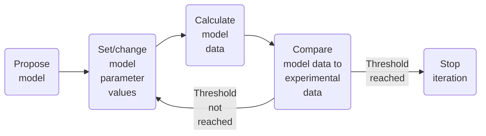

# Analysis

This section contains information about the analysis of diffraction data in
EasyDiffraction.

### Model-dependent analysis

There are two general approaches to the analysis of data: **model-dependent**
and **model-independent**. In the following examples, we are going to focus on
the former. However, the latter is worth briefly highlighting.

A model-independent approach to analysis is where no assumptions are made about
the system that is being studied and conclusions are drawn only from the data
that has been observed. However, in many applications, it is desirable to
include what we think we know about the system, and so model-dependent analysis
is used.

Model-dependent analysis involves the development of a mathematical model that
describes the model dataset that would be found for our system. This
mathematical model usually has parameters that are linked to the physics and
chemistry of our system. These parameters are varied to optimise the model,
using an optimisation algorithm, with respect to the experimental data, i.e., to
get the best agreement between the model data and the experimental data.

Below is a diagram illustrating this process:

Model-dependent analysis is popular in the analysis of neutron scattering data,
and we will use it in the following examples.

## Calculation engines

EasyDiffraction is designed to be a flexible and extensible tool for calculating
diffraction patterns. It can use different calculation engines to perform the
calculations.

We currently rely on [CrysPy](https://www.cryspy.fr) as a calculation engine.
CrysPy is a Python library originally developed for analysing polarised neutron
diffraction data. It is now evolving into a more general purpose library and
covers powders and single crystals, nuclear and (commensurate) magnetic
structures, unpolarised neutron and X-ray diffraction.

Another calculation engine is
[CrysFML](https://code.ill.fr/scientific-software/CrysFML2008). This library is
a collection of Fortran modules for crystallographic computations. It is used in
the software package [FullProf](https://www.ill.eu/sites/fullprof/), and we are
currently working on its integration into EasyDiffraction.

## Minimisation engines

EasyDiffraction uses different third-party libraries to perform the
model-dependent analysis.

Most of the examples in this section will use the
[lmfit](https://lmfit.github.io/lmfit-py/) package, which provides a high-level
interface to non-linear optimisation and curve fitting problems for Python. It
is one of the tools that can be used to fit models to the experimental data.

Another package that can be used for the same purpose is
[bumps](https://bumps.readthedocs.io/en/latest/). In addition to traditional
optimizers which search for the best minimum they can find in the search space,
bumps provides Bayesian uncertainty analysis which explores all viable minima
and finds confidence intervals on the parameters based on uncertainty in the
measured values.
